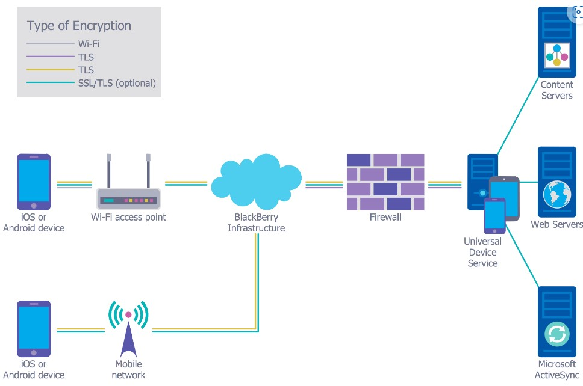

# CN

## Unit 4

Q1. Diff between TCP and IP / Explain the protocols of transport layer (Note: write the points individually if difference is not asked)

|Params| TCP | IP  |
|:----|:----:|----:|
|Definition|TCP provides the service of exchanging data between applications|IP handles addressing and routing messages to the computers across one or more networks|
|Connection|Connection Oriented|Connection less method|
|Location|Transport|Internet|
|Reliability|Reliable|Unreliable|
|Transfer|Segments to internet layer|Datagrams to physical level|
|Flow control|YES|NO|
|Format|TCP segments have a 20 byte header with >= 0 bytes of data|IP datagrams contain a message, or one fragment of a message, that may be up to 65,535 bytes (octets) in length|

Q2. Protocols of Application layer

    A. TELNET: 
        1. Telnet stands for the TELetype NETwork.
        2. It helps in terminal emulation.
        3. It allows Telnet clients to access the resources of the Telnet server. 
        4. It is used for managing files on the internet. 
    B. FTP:
        1. FTP stands for file transfer protocol. 
        2. It is the protocol that actually lets us transfer files. 
        3. It can facilitate this between any two machines using it.
        4. It is also a program
        5. Command: ftp machinename
    C. TFTP:
        1. The Trivial File Transfer Protocol (TFTP) is the stripped-down, stock version of FTP, but it’s the protocol of choice if you know exactly what you want and where to find it.
        2. A more simple FTP
        3. Command: tftp [ options... ] [host [port]] [-c command]
    D. NFS:
        1. It stands for a network file system. It allows remote hosts to mount file systems over a network and interact with those file systems as though they are mounted locally. 
        2. Command: service nfs start
    E. SMTP:
        1. It stands for Simple Mail Transfer Protocol. It is a part of the TCP/IP protocol. 
        2. Using a process called “store and forward,” SMTP moves your email on and across networks.
        3. It works closely with something called the Mail Transfer Agent (MTA)
        4. Command: MAIL FROM:<mail@abc.com?
    F.  LPD:
        1. It stands for Line Printer Daemon. 
        2. It is designed for printer sharing.
        3. Command: lpd [ -d ] [ -l ] [ -D DebugOutputFile]
    G. X window:
        1. It defines a protocol for the writing of graphical user interface–based client/server applications. The idea is to allow a program, called a client, to run on one computer. 
        2. Port number for X window starts from 6000 and increases by 1 for each server.
        3. Command  Run xdm in runlevel 5
    H. SNMP:
        1. It stands for Simple Network Management Protocol. It gathers data by polling the devices on the network from a management station at fixed or random intervals, requiring them to disclose certain information.
        2. The Port number of SNMP is 161(TCP) and 162(UDP). 
        3. Command: snmpget -mALL -v1 -cpublic snmp_agent_Ip_address sysName.0
    I. DNS:
        1. It stands for Domain Name System. 
        2. Every time you use a domain name, therefore, a DNS service must translate the name into the corresponding IP address.
        3. The Port number for DNS is 53.
        4. Command: ipconfig /flushdns
    J.  DHCP:
        1. It stands for Dynamic Host Configuration Protocol (DHCP). It gives IP addresses to hosts.
        2. There is a lot of information a DHCP server can provide to a host when the host is registering for an IP address with the DHCP server.
        3. Port number for DHCP is 67, 68.
        4. Command: clear ip dhcp binding {address | * }

Q3. Elaborate Three-way Handshake.

    • In a three-way handshake, the first sender sends the SYN message to the receiver then the receiver sends back the SYN ACK message to confirm tha the message has been received.
    • After receiving the SYN ACK message, the sender sends the acknowledgment message to the receiver. 
    • In this way, the connection is established between the computers.
    • Once the connection is established, the data will be delivered.
    • This protocol guarantees the data delivery means that if the data is not received then the TCP will resend the data.
    • It is a process of initiating and acknowledging a connection.
    • Once the connection is established, data transfer begins, and when the transmission process is finished, the connection is terminated by the closing of an   established virtual circuit.

Q4. Multimedia encryption and decryption

A. Encryption

    1. Multimedia encryption is a technology that applies to digital multimedia to protect confidentiality of the media content, prevent unauthorized access, and provide persistent access control and rights management of the content
    2. It is an application of general encryption that the representation of multimedia is encrypted such that the content cannot be rendered intelligibly or to an acceptable perceptual quality
    3. These technologies include cryptosystems, block and stream ciphers, and cryptanalysis
    4. Data coded or compressed according to the already known standard MPEG audio layer 3. It is based on the fact that adequate copyright protection for a product can be guaranteed

B. Decryption

    1. Decryption is done via a specific device at the users end
    2. Decryption device can remove the encryption protection surrounding the data
    3. It is very important that all decryption devices, as well as the decryption device of the customer who paid for the multimedia data, can read the multimedia data and cannot alter it
    4. Encrypting data should be a head process

Q6. TCP vs UDP

Q7. You are a network Admin of ABC coroporation
suddenly one day all employees find That they are getting malicious Emails and employees are
enable to access explore
any Banking website. admin identify the issues
Asa nut work present in network also explain how
you can trouble shoot net work.

    Ans 

    1. Will go the default network page see what the problem is 
    2. If someone has hacked the network then firstly changing the networks password. Turning off wps option
    3. Reseting the router
    4. Telling employees to block that malicious email account
    5. Changing the security of router to maximum security.
    6. To insure this should never happen again we can use monitoring apps which constantly report the network activites

## Unit 5

Q1. Explain the working of MD5 algorithm

    1. The MD5 (message-digest algorithm) hashing algorithm is a one-waycryptographic function that accepts a message of any length as input and returns as output a fixed-length digest value to be used for authenticating the original message
    2. The MD5 message-digest hashing algorithm processes data in 512-bit strings, broken down into 16 words composed of 32 bits each
    3. Steps
        a. Adding padding bits 
            Appending In the first step, we add padding bits in the original message in such a way that the total length of the message is 64 bits less than the exact multiple of 512
        b. Adding length bits 
            we add the length bit in the output of the first step in such a way that the total number of the bits is the perfect multiple of 512
        c. Initialize MD buffer (J,K,L,M)
        d. Process the buffers
            i. A compression function includes four rounds of processing
            ii. Each round creates an input the current 512-bit block being processed
            iii. We use 3 buffers for each function i.e. K, L, M
            iv. Functions are
                I. F(K, L, M) = (K AND L) OR (NOT K AND M)
                II. G(K, L, M) = (K AND L) OR (L AND NOT M)
                III. H(K, L, M) = K XOR L XOR M
                IV. I(K, L,M) = L XOR (K OR NOT M)
            v. For each iteration 16 operations are performed (Operations add adding modulo 2^32 and left shift by n bits) then output of one buffer is passed to the other after some special operations
            vi. This process is repeated until operations are performed on last M buffer 
        f. Thus we get our message digest from M buffer

Q2. Explain digital signature

    1. Digital Signature is a technique which is used to validate the authenticity and integrity of the message
    2. So encryption takes place by sender's private key and decrption takes place to varify it
    3. We can identify the person by the encryption key as it was encrypted with sender's private key
    4. There are two approaches to it
        a. RSA Approaches (RSA Encrption is used )
        b. DSS / DSA Approaches (Verification is done by verification function)
    5.Digital signatures assures us the identity of the sender
    6. It also guarantees the security of the message

Q3. SHA - 1 algorithm and how it used?

    a. SHA-1 (short for Secure Hash Algorithm 1) is one of several cryptographic hash functions
    b. It's most often used to verify a file has been unaltered
    c. This is done by producing a checksum before the file has been transmitted, and then again once it reaches its destination
    d. The transmitted file can be considered genuine only if both checksums are identical
    e. Real world examples
        a. One real-world example where SHA-1 may be used is when you're entering your password into a website's login page
        b. If the website uses the SHA-1 cryptographic hash function, it means your password is turned into a checksum after you enter it in. That checksum is then compared with the checksum that's stored on the website that relates to your current password, whether you haven't changed your password since you signed up or if you just changed it moments ago. If the two match, you're granted access
        c. Suppose you have download a GTA 5 file to see whether it is corrupted or not

## Unit 6

Q.1. Types of attacks.

    A.) Active attacks: An Active attack attempts to alter system resources or affect their operations. Active attacks involve some modification of the data stream or the creation of false statements. Types of active attacks are as follows: 

    1. Masquerade
    2. Modification of messages
    3. Repudiation
    4. Replay
    5. Denial of Service
   
    1. Masquerade – 
    A masquerade attack takes place when one entity pretends to be a different entity. A Masquerade attack involves one of the other forms of active attacks.  If an authorization procedure isn’t always absolutely protected, it is able to grow to be extraordinarily liable to a masquerade assault. Masquerade assaults may be performed using the stolen passwords and logins, with the aid of using finding gaps in programs, or with the aid of using locating a manner across the authentication process.
    
    2.  Modification of messages –
    It means that some portion of a message is altered or that message is delayed or reordered to produce an unauthorized effect. Modification is an attack on the integrity of the original data. It basically means that unauthorized parties not only gain access to data but also spoof the data by triggering denial-of-service attacks, such as altering transmitted data packets or flooding the network with fake data. Manufacturing is an attack on authentication. For example, a message meaning “Allow JOHN to read confidential file X” is modified as “Allow Smith to read confidential file X”. 

    3. Repudiation – 
    This attack occurs when the network is not completely secured or the login control has been tampered with. With this attack, the author’s information can be changed by actions of a malicious user in order to save false data in log files, up to the general manipulation of data on behalf of others,  similar to the spoofing of e-mail messages.  

    4. Replay – 
    It involves the passive capture of a message and its subsequent transmission to produce an authorized effect. In this attack, the basic aim of the attacker is to save a copy of the data originally present on that particular network and later on use this data for personal uses. Once the data is corrupted or leaked it is insecure and unsafe for the users.
    
    5. Denial of Service – 
    It prevents the normal use of communication facilities. This attack may have a specific target. For example, an entity may suppress all messages directed to a particular destination. Another form of service denial is the disruption of an entire network either by disabling the network or by overloading it with messages so as to degrade performance.
    
    B.) Passive attacks: A Passive attack attempts to learn or make use of information from the system but does not affect system resources. Passive Attacks are in the nature of eavesdropping on or monitoring transmission. The goal of the opponent is to obtain information that is being transmitted. Types of Passive attacks are as follows: 

    1. The release of message content
    2. Traffic analysis
    1. The release of message content – 
    Telephonic conversation, an electronic mail message, or a transferred file may contain sensitive or confidential information. We would like to prevent an opponent from learning the contents of these transmissions. 
    
    2. Traffic analysis – 
    Suppose that we had a way of masking (encryption) information, so that the attacker even if captured the message could not extract any information from the message. The opponent could determine the location and identity of communicating host and could observe the frequency and length of messages being exchanged. This information might be useful in guessing the nature of the communication that was taking place. The most useful protection against traffic analysis is encryption of SIP traffic. To do this, an attacker would have to access the SIP proxy (or its call log) to determine who made the call.

Q2. Deffie hellman algorithm

    Step 1: Alice and Bob get public numbers P = 23, G = 9

    Step 2: Alice selected a private key a = 4 and
            Bob selected a private key b = 3

    Step 3: Alice and Bob compute public values
    Alice:    x =(9^4 mod 23) = (6561 mod 23) = 6
            Bob:    y = (9^3 mod 23) = (729 mod 23)  = 16

    Step 4: Alice and Bob exchange public numbers

    Step 5: Alice receives public key y =16 and
            Bob receives public key x = 6

    Step 6: Alice and Bob compute symmetric keys
            Alice:  ka = y^a mod p = 65536 mod 23 = 9
            Bob:    kb = x^b mod p = 216 mod 23 = 9

    Step 7: 9 is the shared secret.

Q3. Threat vs Vulnerability

| Threat | Vulnerability |
| -------| --------------|
| Take advantage of vulnerabilities in the system and have the potential to steal and damage data | Known as the weakness in hardware, software, or designs, which might allow cyber threats to happen |
| Generally, can’t be controlled | Can be controlled |
| It may or may not be intentional | Generally, unintentional |
| Can be blocked by managing the vulnerabilities | Vulnerability management is a process of identifying the problems, then categorizing them, prioritizing them, and resolving the vulnerabilities in that order |
| Can be detected by anti-virus software and threat detection logs | Can be detected by penetration testing hardware and many vulnerability scanners |

Q4. Pillars of cyber security

    Authentication
        a. Authentication is the process of proving the identity of a user of a system by means of a set of credentials
        b. Credentials are the required proof needed by the system to validate the identity of the user
        c. The principal represents the identity of the user for a given service
    Authorization
        a. Once a user's identity has been validated, the user can be checked for access to a system resource. The process by which a user is given access to a system resource is known as authorization
        b. The user's records are the system resources needed by the user
        c. The authorization process is the check by the organization's system to see whether the user should be granted access to the user's record
    Confidentiality
        a. To protect data from being accessed by unauthorized readers, the data is changed to keep it confidential
        b. Only people allowed to read the information can unlock the secret file for the original message (usually with a key)
        c. An organization should be concerned about confidentiality techniques whenever it wants to protect information that is being transmitted to another system
    Integrity
        a. During the transmission or storage of data, information can be corrupted or changed, maliciously or otherwise , by a user
        b. Validation is the process of ensuring data integrity

Q5. Network security with diagram.

    1. The Internet is a giant computer network which connects computers all over the world. It is integral part of human society and business
    2. There are quite a number of hardware, software and physical methods of protection which can be used
    3. The enforcement of network security, whether it be local network security, or wireless network security is the core for creating the secure environment of the daily working processes
    4. We can also use various types of encrptions to protect ourselves against hackers
    5. The visual scheme of the security system can be presented in the form of a Network Security diagram
    6. Network security is accomplished through hardware and software

Q6. Key Encryptions

    Types of key encryption are
        1. Symmetric: 
            i. This type of key, also known as a secret key, is a single key used to both encrypt and decrypt information. 
            ii. Types of encryption that use a symmetric key include AES, DES and Twofish
        2.Asymmetric 
            i. An asymmetric encryption key uses a pair of mathematically connected keys: one to encrypt, the other to decrypt
            ii. This type of key, also known as public/private encryption, can only be unlocked with a matching key
            iii. Types of encryption that use an asymmetric encryption key include DSA, RSA and ECC
