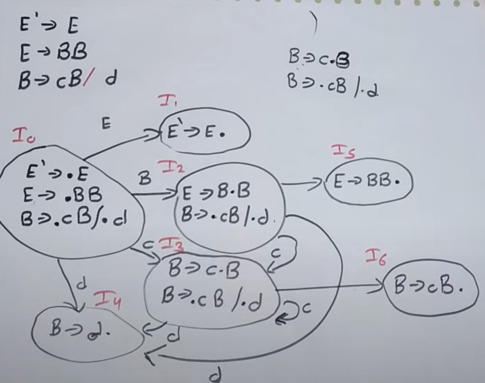
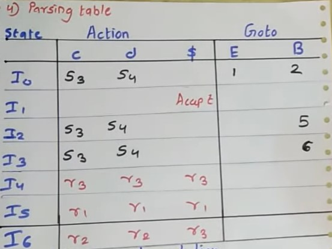

# LPCC

## Unit 4 Parsers

Q1. Construct parsing table for LL and LR parser using the following grammer

(Note: The grammer used here can vary but in exam only one grammer will be given)

    A. For LL parser

    B. For LR parser

Q2. Check whether grammer is LR or LL grammer

**Note: (We will only show for LL the identification process remains the same for LR parser)*

Q3. First and Follow examples

    A. Computing First for:
    E -> TE’ 
    E’ -> + TE’ | epsilon
    T -> FT’ 
    T’ -> * FT’ | epsilon
    F -> ( E ) | id

    FIRST(E) = first(TE’) = first(T) =  first(FT’)   =first(F) ={(, id}
    First(E’) = {+, epsilon}
    First(T’) = {*, epsilon}

    B. Compute Follow for
    S -> aABb
    A -> c | epsilon
    B -> d | epsilon

    Follow(S) = {$} // as there is nothing on right of S
    Follow(A) = {d}
    Follow(B) = {b}

Q4. Closure and goto LR(0) parser example

Closure: It is nothing but a dot in augmented grammar. Example X = Y . K (It only tells that Y is parsed and K is not parsed. So the things on rigth side are not parsed)

Goto: It is like a jump from one state of DFD to other. It is very essential as it is used in parsed table. It is noted like from I0 state where it went.

    Grammar
    E -> E`
    E -> BB
    B -> cB | d

Q5. Show/present various cononical item set (LR parsing table) for given grammer

Q6. Stack implimentation of LL and LR parser

    For LR parser

    For LL parser

    S -> aABb
    A -> c | epsilon
    B -> d | epsilon

Those who are having difficulty in LR parsing. Please watch

<https://youtu.be/MWX0-_mHYcc>

Q7.  What are parsers?

    1. It generates IR (Parse tree)
    2. Performs context-free syntax analysis and error correction
    3. Types of parsers
    A.Top-down
        a. Builds parse tree from root (top) to leaves (bottom)
        b. may require backtracking
        c. Includes Recursive Descent parser, Predictive parsers
    B. Bottom-up
        a. Builds parse tree from leaves (bottom) to root (up)
        b. As input is consumed, changes state to encode possibilities (recognize valid prefixes)
        c. Includes LR parser,LR parser

Q8. Find first and follow

    S → aBDh
    B → cC
    C → bC / ∈
    D → EF
    E → g / ∈
    F → f / ∈

    Answer

    First(S) = { a }
    First(B) = { c }
    First(C) = { b , ∈ }
    First(D) = { First(E) – ∈ } ∪ First(F) = { g , f , ∈ }
    First(E) = { g , ∈ }
    First(F) = { f , ∈ }

    Follow(S) = { $ }
    Follow(B) = { First(D) – ∈ } ∪ First(h) = { g , f , h }
    Follow(C) = Follow(B) = { g , f , h }
    Follow(D) = First(h) = { h }
    Follow(E) = { First(F) – ∈ } ∪ Follow(D) = { f , h }
    Follow(F) = Follow(D) = { h }

## Unit 5 Semantic analysis

Q1. Difference between syntax and parse trees

Q2. Three address code (if-else)

    if (a > b) && (c > d) 
        then t = 1 
        else t = 0

Q3. Three address code (expression)

Q4. Syntax tree using SDT or SDD

Q5. Infix to postfix using SDT

    SDT for infix to postfix conversion of expression for given grammar :

    Grammar :

    E -> E + T { print(‘+’) }

    E -> E – T { print(‘-‘) }

    E -> T { }

    T -> id { print(‘id’) }

Q6. Explain L-attributes and S-attributes

    S-attributed:
        1. If every attribute is synthesized, then an SDT is called S-attributed
        2. If every attribute is synthesized, then an SDT is called S-attributed
        3. Example
        L => E n E => E1 + T E => T  T => T1 * F T => F F => ( E ) F => digit

    L-attributed:
        1. If an attribute of an SDT is synthesized or inherited with some restriction on inherited attributes, it can inherit values from left siblings only
        2. Attributes of this SDT are evaluated by depth-first
        3. Semantic actions are placed anywhere in RHS 
        4. X => ABC {B.P = X.P, B.P = A.P}

## Unit 6 Code Optimization

Q1. 
